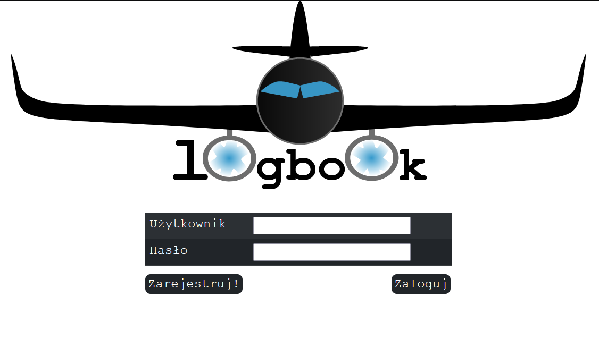
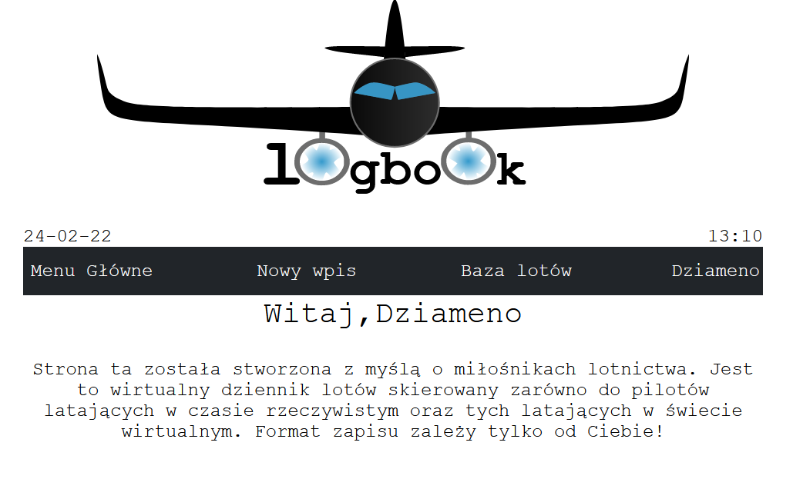
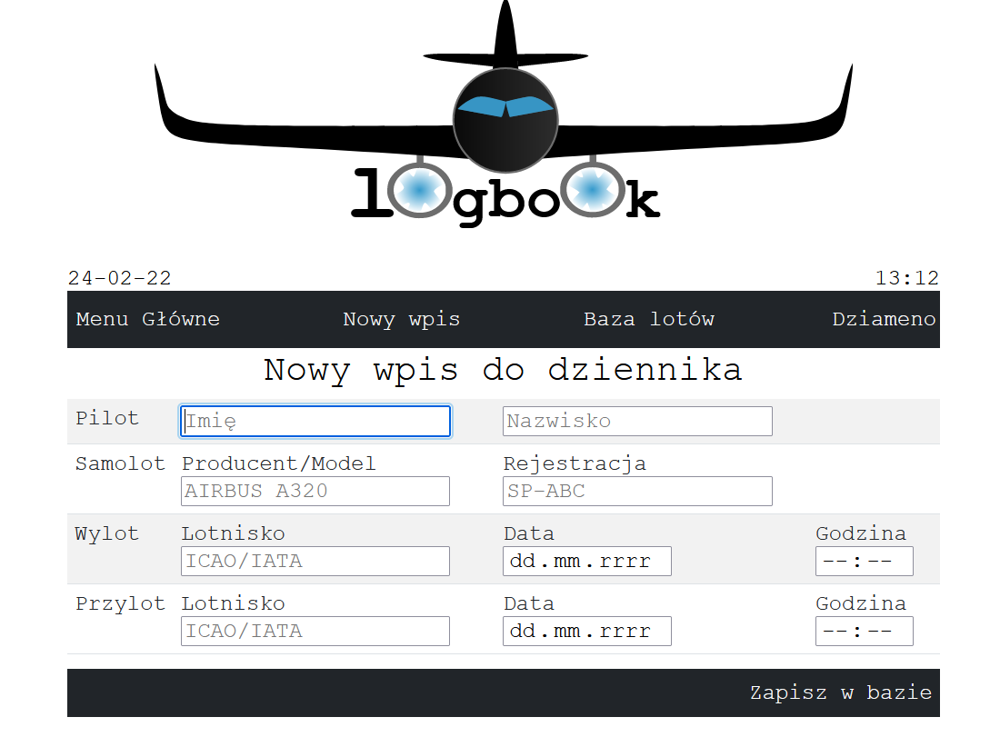
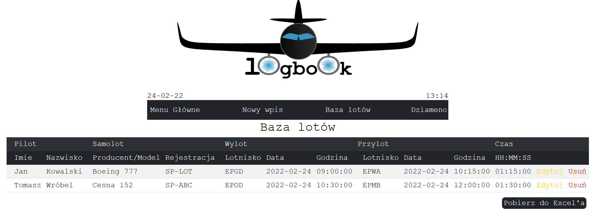
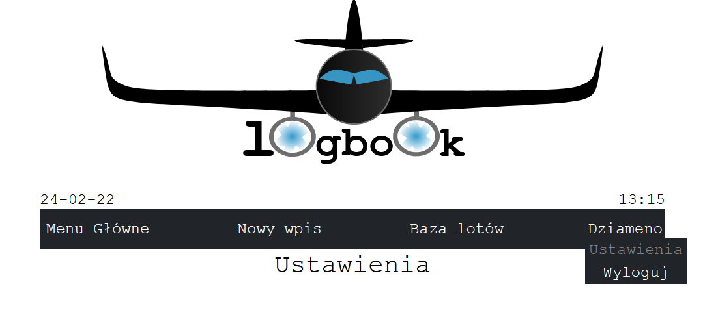

# Logbook site
Logbook site created as final project for Programming Workshops on II SEM PJAIT

## Technologies used in project
* PHP
* MySQL
* Bootstrap

### Site was created for people that want to record their own flights.
In real life it's called logbook and you use a pen and your brain to calculate time.
Here you don't need to to this.
Site is calculating your trip time, you can edit it any time and download it to excel if you wish.
Even if you are enthusiast of flying simulators, you can use it as well. Nobody checks it!

## Login

## User welcome site

## New flight

## List of all user flights

## Settings and logout bar

